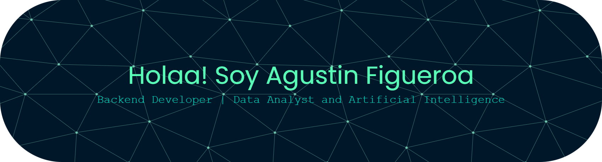

</-------------/>

## 🧑‍💻 Sobre mí

  <strong>¡Hola!</strong> Soy un apasionado por la tecnología desde 🇦🇷. Me encanta aprender haciendo, resolver problemas reales con soluciones simples y compartir siempre con buena onda 🤝✨

<h2> Conectemos  </h2>

 <a href="https://www.github.com/AFigueroaAgustin" target="_blank" rel="noreferrer"> <picture> <source media="(prefers-color-scheme: dark)" srcset="https://raw.githubusercontent.com/danielcranney/readme-generator/main/public/icons/socials/github-dark.svg" /> <source media="(prefers-color-scheme: light)" srcset="https://raw.githubusercontent.com/danielcranney/readme-generator/main/public/icons/socials/github.svg" />  </picture> </a> <a href="https://www.linkedin.com/in/agustinfigueroa390" target="_blank" rel="noreferrer"> <picture> <source media="(prefers-color-scheme: dark)" srcset="https://raw.githubusercontent.com/danielcranney/readme-generator/main/public/icons/socials/linkedin-dark.svg" /> <source media="(prefers-color-scheme: light)" srcset="https://raw.githubusercontent.com/danielcranney/readme-generator/main/public/icons/socials/linkedin.svg" />  </picture> </a>
   
    

<h2>🚀 Herramientas y tecnologías</h2>

  
  
  
  
  
  
  
  
  
  
  
  

## 🧠 Proyectos destacados

A continuación, algunos de los proyectos que estoy desarrollando y manteniendo activamente. Algunos están publicados, otros en proceso de mejora y otros pronto serán subidos a mi perfil.

### 🎮 Juego de TA-TE-TI en Python
- Desarrollo modular en múltiples archivos `.py` para facilitar mantenimiento y escalabilidad.
- Lógica de validación de jugadas, turnos y detección de empate o victoria.
- Análisis con flujo de control (*caja blanca*).
- Implementación en curso de interfaz gráfica con Tkinter.
- 📌 [Ver en GitHub](https://github.com/AFigueroaAgustin/recreacion-TaTeTi-python)

---

### 🔄 API REST con Spring Boot + JPA
- CRUD básico usando Java, Spring Boot, JPA y PostgreSQL.
- Arquitectura en capas: controladores, servicios y repositorios bien separados.
- Proyecto dockerizado para facilitar despliegues.
- 📌 [Ver en GitHub](https://github.com/AFigueroaAgustin/Java-CRUD-api-test)

---

### 💸 Caja Registradora con Swing (En desarrollo)
- Proyecto en Java con GUI desarrollada en Swing para una caja de cobranzas.
- Incluye lógica para registrar ventas
- Ticket de compra
- 📌 [Ver en GitHub](https://github.com/AFigueroaAgustin/SistemaPuntoDeVenta-Java)

---

### 🧮 Calculadora de Impuestos (Próximamente)
- Aplicación en Python con interfaz Tkinter para calcular intereses futuros de inversiones.
- Herramienta enfocada en planificación financiera personal.
- Será publicada próximamente.

---

### 🚧 Más proyectos en camino...
Estoy constantemente aprendiendo y sumando nuevas ideas. Algunos desarrollos están aún en progreso o esperando ser subidos. ¡Estate atento a las novedades en mi repositorio!

